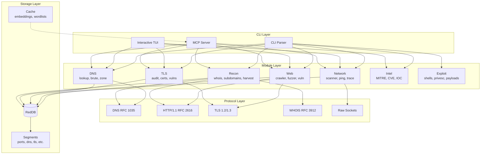
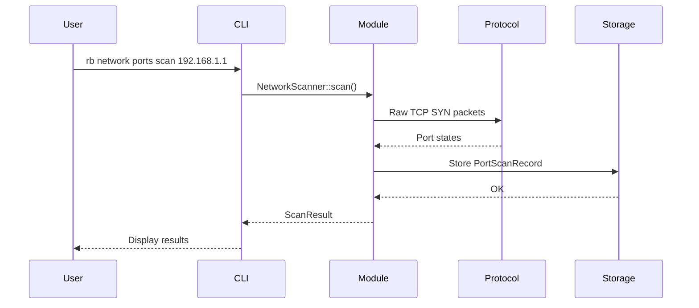

# Architecture Overview

redblue is a **single binary** security platform that replaces 30+ traditional security tools with zero external dependencies.

## Design Principles

1. **Zero Dependencies** - Only Rust std library + libc for syscalls
2. **Single Binary** - No external tool calls, no Python, no Node
3. **From Scratch** - All protocols implemented natively (DNS, HTTP, TLS, etc.)
4. **Unified Storage** - RedDB for all persistent data
5. **LLM-Ready** - MCP integration for AI-assisted security

## System Architecture



## Data Flow



## Directory Structure

```
src/
├── cli/                    # Command-line interface
│   ├── commands/          # Command implementations
│   ├── mod.rs             # CLI registration
│   └── tui.rs             # Interactive terminal UI
│
├── protocols/             # FROM SCRATCH implementations
│   ├── dns.rs             # DNS client (RFC 1035)
│   ├── http.rs            # HTTP/1.1 client
│   ├── http2.rs           # HTTP/2 client
│   ├── tls12.rs           # TLS 1.2 handshake
│   ├── tls13.rs           # TLS 1.3 handshake
│   ├── tls_cert.rs        # X.509 certificate parsing
│   ├── whois.rs           # WHOIS client (RFC 3912)
│   └── raw.rs             # Raw socket operations
│
├── storage/               # RedDB storage engine
│   ├── store.rs           # Main database interface
│   ├── records.rs         # Record types
│   ├── segments/          # Segment implementations
│   ├── engine/            # B-tree, HNSW, pager
│   └── query/             # Query language
│
├── modules/               # Security modules
│   ├── network/           # Port scanning, host discovery
│   ├── web/               # Crawling, fuzzing, vulns
│   ├── recon/             # OSINT, subdomain enum
│   ├── tls/               # TLS auditing
│   ├── intel/             # MITRE ATT&CK, CVE lookup
│   ├── exploit/           # Shells, privesc
│   └── evasion/           # Anti-detection
│
├── crypto/                # Cryptographic primitives
│   ├── aes.rs             # AES-128/256
│   ├── chacha.rs          # ChaCha20-Poly1305
│   ├── sha.rs             # SHA-1, SHA-256, SHA-384
│   └── x25519.rs          # X25519 key exchange
│
├── mcp/                   # Model Context Protocol
│   ├── server.rs          # MCP server (100+ tools)
│   ├── prompts.rs         # Security prompts (35+)
│   ├── resources.rs       # Resource URIs (40+)
│   └── orchestrator.rs    # Autonomous operations
│
└── agent/                 # C2 Agent (authorized use only)
    └── client/            # Agent client
```

## Key Components

### CLI Layer
- **Command Parser**: Domain/resource/verb pattern (`rb network ports scan`)
- **Interactive TUI**: Terminal UI for live operations
- **MCP Server**: LLM integration via stdio/HTTP transport

### Module Layer
- **Self-contained**: Each module implements its own logic
- **Event emission**: Modules emit structured events
- **Storage integration**: Results persist to RedDB

### Protocol Layer
- **Zero dependencies**: All protocols implemented from scratch
- **Raw access**: Direct socket operations for scanning
- **Cryptographic**: Full TLS 1.2/1.3 support

### Storage Layer
- **RedDB**: Custom page-based storage engine
- **Segments**: Typed data segments (ports, dns, tls, vulns)
- **Indexes**: B-tree and HNSW vector indexes

## See Also

- [Protocol Implementations](01-protocols.md)
- [Storage Engine (RedDB)](02-storage.md)
- [Module System](03-modules.md)
- [MCP Integration](04-mcp.md)
