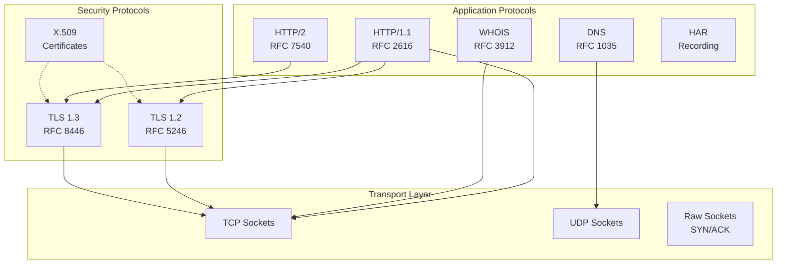
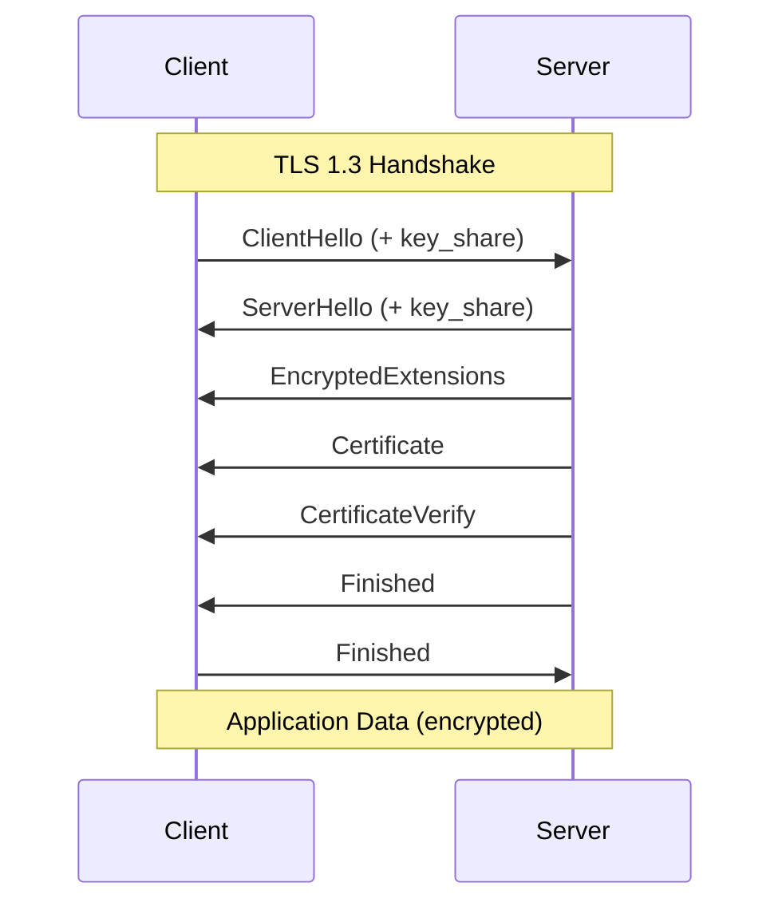

# Protocol Implementations

redblue implements all network protocols from scratch using only Rust's standard library.

## Philosophy

> **We don't wrap other tools. We ARE the tool.**

No external crates for protocols. No reqwest, no hyper, no trust-dns, no openssl.

## Protocol Stack



## DNS (`src/protocols/dns.rs`)

Full DNS client implementation supporting all major record types.

**Features:**
- A, AAAA, MX, NS, TXT, CNAME, SOA, PTR records
- UDP and TCP transport
- EDNS0 support
- Response parsing and validation

**Usage:**
```rust
use crate::protocols::dns::{DnsClient, RecordType};

let client = DnsClient::new("8.8.8.8:53")?;
let response = client.query("example.com", RecordType::A)?;
```

## HTTP (`src/protocols/http.rs`)

HTTP/1.1 client with keep-alive, chunked encoding, and redirect following.

**Features:**
- GET, POST, PUT, DELETE, HEAD, OPTIONS
- Chunked transfer encoding
- Automatic redirect following
- Header manipulation
- Request/response streaming

**Usage:**
```rust
use crate::protocols::http::HttpClient;

let client = HttpClient::new();
let response = client.get("http://example.com")?;
println!("Status: {}", response.status);
```

## HTTP/2 (`src/protocols/http2.rs`)

HTTP/2 implementation with multiplexing and header compression.

**Features:**
- Binary framing
- Multiplexed streams
- HPACK header compression
- Server push support
- Flow control

## TLS (`src/protocols/tls12.rs`, `tls13.rs`)

Full TLS 1.2 and 1.3 handshake implementations.

**TLS 1.2 Features:**
- RSA and ECDHE key exchange
- AES-GCM and ChaCha20-Poly1305 cipher suites
- Certificate chain validation
- Session resumption

**TLS 1.3 Features:**
- 0-RTT early data
- Encrypted extensions
- PSK key exchange
- Certificate-based authentication



## X.509 Certificates (`src/protocols/tls_cert.rs`)

Certificate parsing and validation.

**Features:**
- DER/PEM parsing
- Subject/Issuer extraction
- Validity period checking
- Extension parsing (SAN, Key Usage)
- Chain validation

## WHOIS (`src/protocols/whois.rs`)

WHOIS client for domain registration data.

**Features:**
- Auto-server detection
- Referral following
- Response parsing
- Rate limiting

## Raw Sockets (`src/protocols/raw.rs`)

Low-level socket operations for network scanning.

**Features:**
- SYN packet crafting
- TCP/IP header manipulation
- Checksum calculation
- Non-blocking I/O
- Platform abstraction (Linux/macOS)

**Usage:**
```rust
use crate::protocols::raw::{RawSocket, TcpFlags};

let socket = RawSocket::new()?;
socket.send_syn("192.168.1.1", 80)?;
```

## HAR Recording (`src/protocols/har.rs`)

HTTP Archive format for request/response logging.

**Features:**
- Full request/response capture
- Timing information
- Cookie handling
- Export to JSON

## Cryptographic Primitives

All crypto is implemented from scratch in `src/crypto/`:

| Algorithm | File | Purpose |
|-----------|------|---------|
| AES-128/256 | `aes.rs` | Block cipher |
| ChaCha20-Poly1305 | `chacha.rs` | Stream cipher + AEAD |
| SHA-1/256/384 | `sha.rs` | Hash functions |
| HMAC | `hmac.rs` | Message authentication |
| X25519 | `x25519.rs` | Key exchange |
| P-256/384 | `ecdsa.rs` | ECDHE key exchange |
| RSA | `rsa.rs` | Key exchange, signatures |

## Equivalent Tools Replaced

| redblue | Traditional Tool |
|---------|------------------|
| `rb dns record lookup` | dig, nslookup, host |
| `rb network ports scan` | nmap, masscan |
| `rb web asset get` | curl, wget |
| `rb recon domain whois` | whois |
| `rb tls cert audit` | testssl.sh, sslyze |

## Adding New Protocols

1. Create `src/protocols/your_protocol.rs`
2. Implement using only `std::net` and `std::io`
3. Add to `src/protocols/mod.rs`
4. Create module integration in `src/modules/`
5. Add CLI command in `src/cli/commands/`
