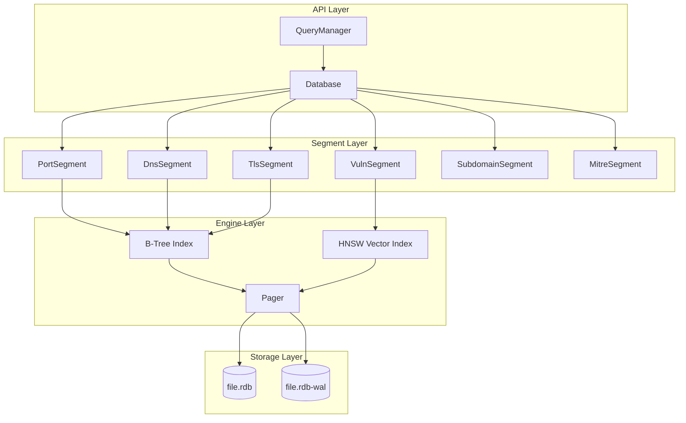
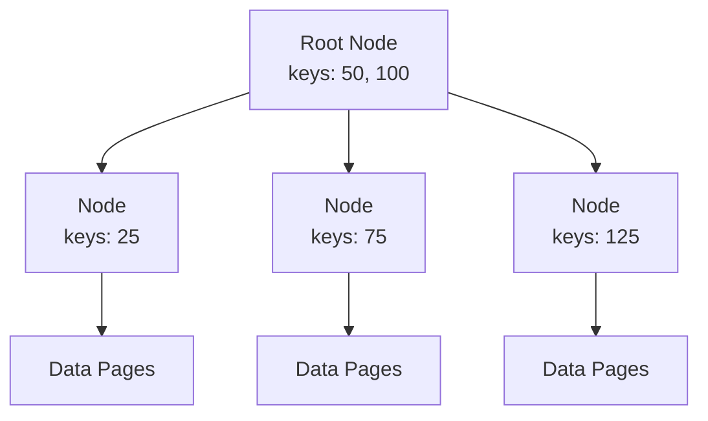
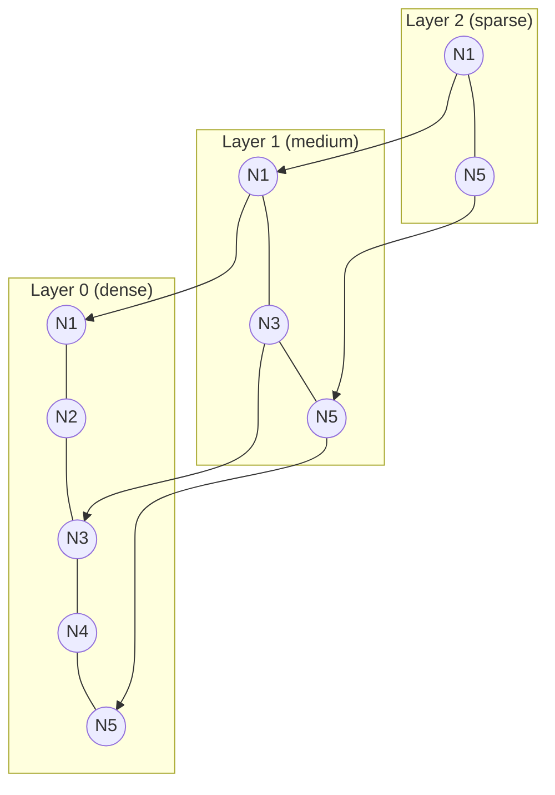
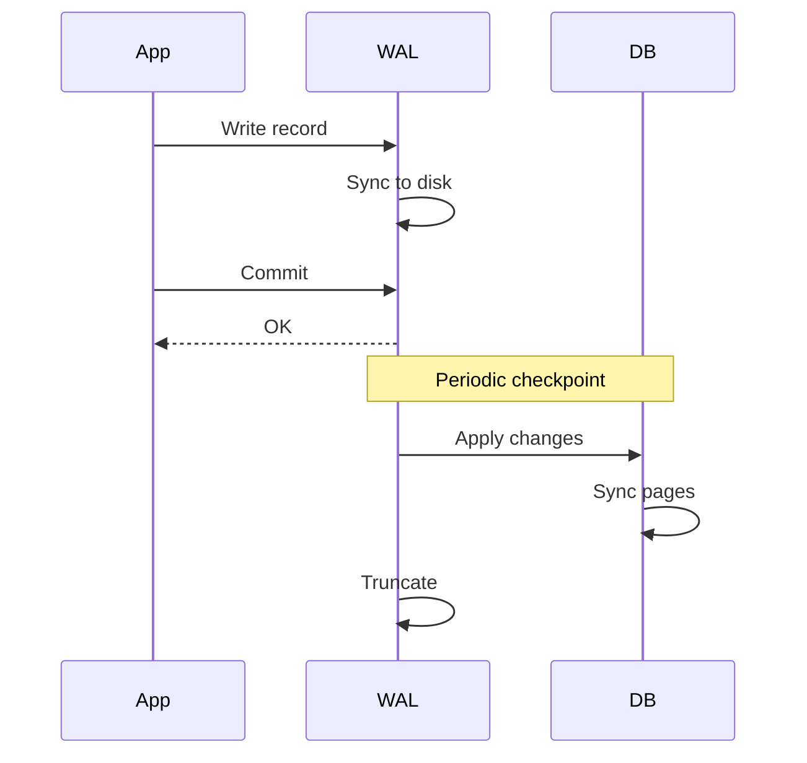

# Storage Engine (RedDB)

RedDB is redblue's custom storage engine optimized for security data.

## Design Goals

1. **Single File** - All data in one `.rdb` file
2. **Typed Segments** - Specialized storage for each data type
3. **Fast Queries** - B-tree indexes for lookups
4. **Vector Search** - HNSW index for semantic similarity
5. **Encryption** - Optional AES-256 encryption at rest

## Architecture



## File Format

```
┌─────────────────────────────────────┐
│           File Header               │
│  - Magic: "REDB"                    │
│  - Version: 1                       │
│  - Flags: encrypted, compressed     │
│  - Page size: 4096                  │
├─────────────────────────────────────┤
│         Section Directory           │
│  - Segment entries                  │
│  - Offset + size for each           │
├─────────────────────────────────────┤
│          Port Segment               │
│  - IP → Port records                │
├─────────────────────────────────────┤
│          DNS Segment                │
│  - Domain → DNS records             │
├─────────────────────────────────────┤
│          TLS Segment                │
│  - Host → TLS audit results         │
├─────────────────────────────────────┤
│          Vuln Segment               │
│  - CVE records + vectors            │
├─────────────────────────────────────┤
│          ... more segments ...      │
└─────────────────────────────────────┘
```

## Segments

Each segment is specialized for its data type:

### PortSegment
Stores port scan results indexed by IP address.

```rust
pub struct PortScanRecord {
    pub ip: IpAddr,
    pub port: u16,
    pub status: PortStatus,  // Open, Closed, Filtered
    pub service_id: u8,
    pub timestamp: u32,
}
```

### DnsSegment
Stores DNS query results.

```rust
pub struct DnsRecordData {
    pub domain: String,
    pub record_type: RecordType,
    pub data: String,
    pub ttl: u32,
    pub timestamp: u32,
}
```

### TlsSegment
Stores TLS audit results.

```rust
pub struct TlsScanRecord {
    pub host: String,
    pub port: u16,
    pub protocol: String,      // "TLS 1.2", "TLS 1.3"
    pub cipher: String,
    pub certificate: Vec<u8>,  // DER encoded
    pub timestamp: u32,
}
```

### VulnSegment
Stores vulnerability data with vector embeddings.

```rust
pub struct VulnerabilityRecord {
    pub cve_id: String,
    pub severity: Severity,
    pub cvss: f32,
    pub description: String,
    pub technology: String,
    pub embedding: Option<Vec<f32>>,  // For semantic search
}
```

## Indexing

### B-Tree Index
Used for exact lookups and range queries.



### HNSW Vector Index
Used for semantic similarity search on vulnerability descriptions.



## Usage

### Opening a Database

```rust
use crate::storage::store::Database;

// Open or create database
let mut db = Database::open("scan.rdb")?;

// Encrypted database
let mut db = Database::open_encrypted("scan.rdb", "password")?;
```

### Storing Data

```rust
use crate::storage::records::PortScanRecord;

let record = PortScanRecord::new(
    0xC0A80101,  // 192.168.1.1
    443,         // port
    0,           // status: Open
    1,           // service_id: HTTPS
);

db.insert_port_scan(record);
db.save()?;
```

### Querying Data

```rust
// Get all ports for an IP
let ports = db.ports_for_ip("192.168.1.1".parse()?);

// Get open ports only
let open_ports = db.open_ports("192.168.1.1".parse()?);

// Get all subdomains
let subdomains = db.all_subdomains();
```

### Using QueryManager

```rust
use crate::storage::client::QueryManager;

let qm = QueryManager::open("scan.rdb")?;

// SQL-like query
let results = qm.query("SELECT * FROM ports WHERE ip = '192.168.1.1'")?;

// Semantic search
let similar = qm.similar("CVE-2021-44228", 10)?;
```

## Write-Ahead Log (WAL)

RedDB uses a WAL for crash recovery:

1. **Write**: Changes written to WAL first
2. **Commit**: WAL synced to disk
3. **Checkpoint**: WAL applied to main file
4. **Cleanup**: WAL truncated



## Encryption

Optional AES-256-GCM encryption:

```rust
// Create encrypted database
let db = Database::open_encrypted("secure.rdb", "strong_password")?;

// Encryption is transparent to API
db.insert_port_scan(record);  // Encrypted on write
let ports = db.ports_for_ip(ip);  // Decrypted on read
```

## Performance

| Operation | Time (typical) |
|-----------|----------------|
| Insert record | < 1ms |
| Lookup by key | < 0.5ms |
| Range scan (1000 records) | < 10ms |
| Vector search (top-10) | < 50ms |
| Checkpoint (10MB) | < 100ms |

## Files

```
src/storage/
├── store.rs           # Main Database struct
├── records.rs         # Record type definitions
├── segments/          # Segment implementations
│   ├── ports.rs
│   ├── dns.rs
│   ├── tls.rs
│   ├── vulns.rs
│   └── ...
├── engine/
│   ├── pager.rs       # Page management
│   ├── btree.rs       # B-tree implementation
│   └── hnsw.rs        # Vector index
└── query/
    └── mod.rs         # Query language
```
