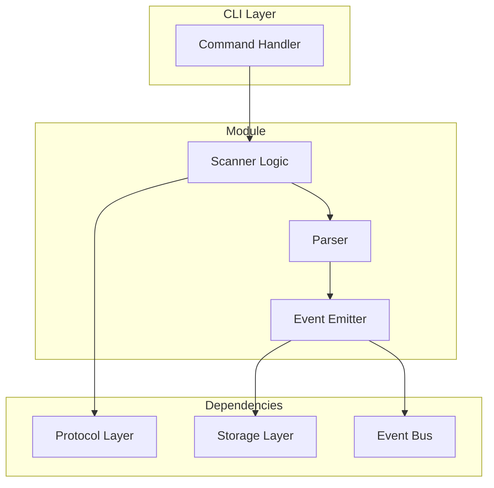
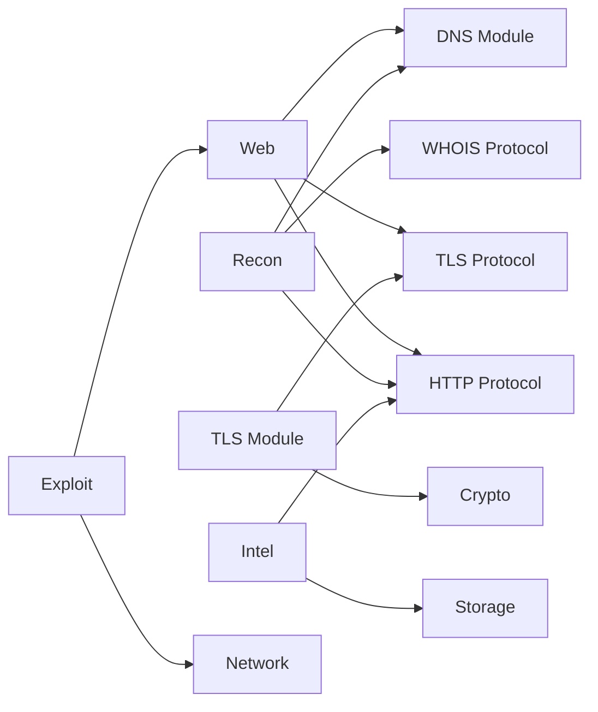

# Module System

redblue's security capabilities are organized into self-contained modules.

## Design Principles

1. **Self-contained** - Each module implements its own logic
2. **Event-driven** - Modules emit structured events
3. **Storage-integrated** - Results persist automatically
4. **CLI-exposed** - Each module has CLI commands

## Module Architecture



## Available Modules

### Network (`src/modules/network/`)

Port scanning, host discovery, and network mapping.

| Component | Purpose |
|-----------|---------|
| `scanner.rs` | SYN/TCP port scanning |
| `host.rs` | Host discovery |
| `trace.rs` | Traceroute |
| `ping.rs` | ICMP ping |

**CLI Commands:**
```bash
rb network ports scan 192.168.1.1 --preset common
rb network host discover 192.168.1.0/24
rb network trace route 8.8.8.8
```

### Web (`src/modules/web/`)

Web application security testing.

| Component | Purpose |
|-----------|---------|
| `crawler.rs` | Website crawling |
| `fuzzer/` | Directory/parameter fuzzing |
| `fingerprinter.rs` | Technology detection |
| `vuln-scanner.rs` | Vulnerability scanning |

**CLI Commands:**
```bash
rb web crawl http://example.com --depth 3
rb web fuzz dir http://example.com/FUZZ
rb web fingerprint http://example.com
```

### Recon (`src/modules/recon/`)

OSINT and reconnaissance.

| Component | Purpose |
|-----------|---------|
| `subdomain.rs` | Subdomain enumeration |
| `whois.rs` | WHOIS lookups |
| `breach.rs` | Breach database checks |
| `harvest.rs` | Email/name harvesting |
| `vuln/` | Vulnerability intelligence |

**CLI Commands:**
```bash
rb recon subdomain enum example.com
rb recon domain whois example.com
rb recon harvest email example.com
```

### TLS (`src/modules/tls/`)

TLS/SSL security auditing.

| Component | Purpose |
|-----------|---------|
| `auditor.rs` | Full TLS audit |
| `scanner.rs` | Protocol enumeration |
| `heartbleed.rs` | Heartbleed testing |
| `comprehensive-audit.rs` | Complete security audit |

**CLI Commands:**
```bash
rb tls audit example.com
rb tls cert show example.com
rb tls vuln check example.com
```

### Intel (`src/modules/intel/`)

Threat intelligence and vulnerability data.

| Component | Purpose |
|-----------|---------|
| `mitre/` | MITRE ATT&CK integration |
| `ioc.rs` | IOC extraction |
| `taxii.rs` | TAXII feed client |
| `attack_database.rs` | Technique database |

**CLI Commands:**
```bash
rb intel vuln search nginx 1.18
rb intel vuln cve CVE-2021-44228
rb intel mitre technique T1190
```

### Exploit (`src/modules/exploit/`)

Exploitation tools (authorized use only).

| Component | Purpose |
|-----------|---------|
| `shells.rs` | Reverse/bind shells |
| `privesc.rs` | Privilege escalation |
| `planner.rs` | Attack planning |
| `post-exploit.rs` | Post-exploitation |

**CLI Commands:**
```bash
rb exploit payload shell bash 10.0.0.1 4444
rb exploit privesc linux enum
rb exploit suggest --target 192.168.1.1
```

### Evasion (`src/modules/evasion/`)

Anti-detection techniques (authorized use only).

| Component | Purpose |
|-----------|---------|
| `sandbox.rs` | Sandbox detection |
| `antidebug.rs` | Anti-debugging |
| `obfuscation.rs` | Code obfuscation |
| `tracks.rs` | Track covering |

### Code (`src/modules/code/`)

Source code security analysis.

| Component | Purpose |
|-----------|---------|
| `secrets/` | Secret detection |
| `deps/` | Dependency analysis |

**CLI Commands:**
```bash
rb code secrets scan ./src
rb code deps audit Cargo.toml
```

## Event System

Modules emit events for cross-module communication:

```rust
use crate::synergy::events::{emit, Event, EventType, EntityRef};

pub fn scan(&self, target: &str) -> Result<ScanResult> {
    let findings = self.execute_scan(target)?;

    // Emit event for each finding
    for finding in &findings {
        let event = Event::new(EventType::VulnFound, "web::scanner")
            .with_entity(EntityRef::vulnerability(&finding.id))
            .with_severity(finding.severity)
            .with_target(target);
        emit(event);
    }

    Ok(ScanResult { findings, .. })
}
```

### Event Types

| Event | Description |
|-------|-------------|
| `PortDiscovered` | New open port found |
| `ServiceIdentified` | Service fingerprinted |
| `VulnFound` | Vulnerability discovered |
| `CredentialFound` | Credential discovered |
| `SubdomainFound` | New subdomain found |
| `TechDetected` | Technology detected |

## Storage Integration

Modules automatically persist results:

```rust
impl Scanner {
    pub fn scan(&self, target: &str) -> Result<()> {
        let mut db = Database::open("scan.rdb")?;

        for result in self.results {
            db.insert_port_scan(result);
        }

        db.save()?;
        Ok(())
    }
}
```

## Creating a New Module

1. **Create module directory:**
   ```
   src/modules/your_module/
   ├── mod.rs
   ├── scanner.rs
   └── parser.rs
   ```

2. **Add to `src/modules/mod.rs`:**
   ```rust
   pub mod your_module;
   ```

3. **Create CLI command:**
   ```
   src/cli/commands/your_module.rs
   ```

4. **Register in `src/cli/commands/mod.rs`:**
   ```rust
   pub mod your_module;
   ```

5. **Create storage segment (if needed):**
   ```
   src/storage/segments/your_data.rs
   ```

## Module Dependencies



## Tool Equivalents

| redblue Module | Traditional Tools |
|----------------|-------------------|
| network | nmap, masscan, hping |
| web | nikto, dirb, gobuster, wfuzz |
| recon | subfinder, amass, theharvester |
| tls | testssl.sh, sslyze, sslscan |
| intel | searchsploit, cve-search |
| exploit | msfconsole, netcat |
| evasion | - (unique) |
