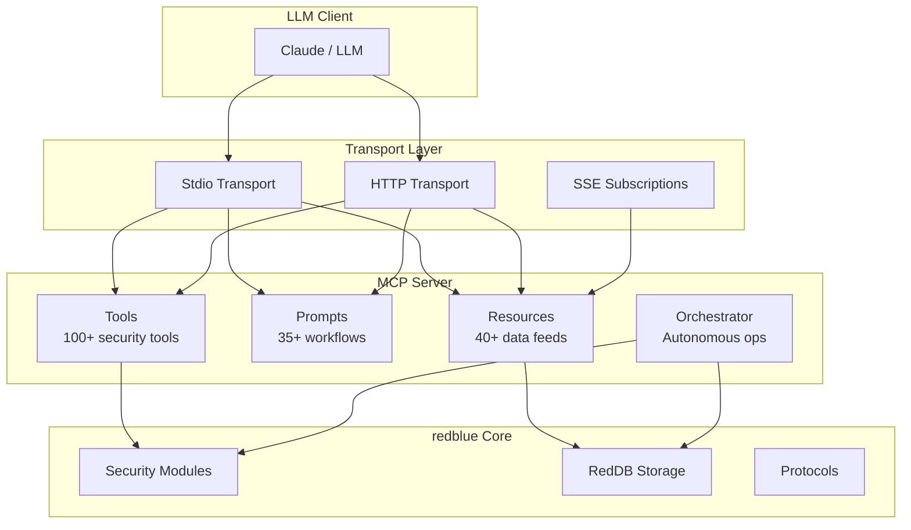
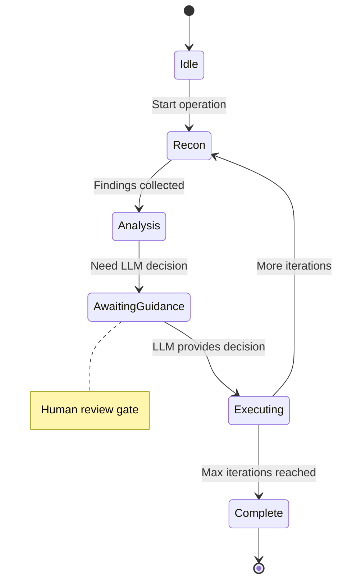

# MCP Integration

redblue includes a full Model Context Protocol (MCP) server for LLM-assisted security operations.

## Overview

The MCP server exposes redblue's capabilities to AI assistants like Claude, enabling:

- **Natural language security queries** - "Find vulnerabilities for nginx 1.18"
- **Autonomous operations** - LLM-guided reconnaissance and assessment
- **Real-time data access** - Live scan results and intelligence feeds
- **Structured workflows** - Pre-built security prompts

## Architecture



## Starting the Server

```bash
# Stdio transport (for Claude Desktop)
rb mcp server start

# With HTTP transport
rb mcp server start --http-addr 127.0.0.1:8787

# Disable SSE subscriptions
rb mcp server start --no-sse
```

## Tools

The MCP server exposes 100+ security tools organized by category:

### Discovery Tools
| Tool | Description |
|------|-------------|
| `rb.list-domains` | List all CLI domains |
| `rb.list-resources` | List resources for a domain |
| `rb.describe-command` | Get help for a command |
| `rb.search-docs` | Search documentation |

### Network Tools
| Tool | Description |
|------|-------------|
| `rb.network.scan` | Port scan with service detection |
| `rb.network.ping` | Host reachability check |
| `rb.network.health` | Multi-port health check |

### Web Tools
| Tool | Description |
|------|-------------|
| `rb.web.crawl` | Website crawling |
| `rb.web.scrape` | CSS selector scraping |
| `rb.web.links` | Link extraction |
| `rb.har.record` | HTTP traffic recording |

### Vulnerability Tools
| Tool | Description |
|------|-------------|
| `rb.vuln.search` | NVD/OSV vulnerability search |
| `rb.vuln.cve` | Detailed CVE information |
| `rb.vuln.kev` | CISA KEV catalog |
| `rb.vuln.exploit` | Exploit-DB search |

### Reconnaissance Tools
| Tool | Description |
|------|-------------|
| `rb.recon.dnsdumpster` | DNS intelligence |
| `rb.recon.massdns` | High-speed DNS bruteforce |
| `rb.dns.lookup` | DNS record queries |

## Prompts

35+ pre-built security prompts with structured arguments:

### Reconnaissance
- `recon-strategy` - Plan reconnaissance approach
- `subdomain-hunt` - Enumerate subdomains

### Vulnerability Assessment
- `vuln-assessment` - Full vulnerability assessment
- `cve-analysis` - Deep CVE analysis
- `patch-priority` - Prioritize patches

### Attack Planning (Authorized Use Only)
- `attack-plan` - Generate attack plan
- `exploit-suggest` - Suggest exploits
- `lateral-movement` - Lateral movement options

### Defense
- `threat-model` - Threat modeling
- `detection-rules` - Create detection rules
- `hardening-guide` - System hardening

### Reporting
- `pentest-report` - Generate pentest report
- `executive-summary` - Executive summary

### Example Usage

```json
{
  "method": "prompts/get",
  "params": {
    "name": "vuln-assessment",
    "arguments": {
      "target": "192.168.1.1",
      "depth": "deep"
    }
  }
}
```

## Resources

40+ resources exposed via `redblue://` URI scheme:

### System Resources
| URI | Description |
|-----|-------------|
| `redblue://system/info` | Version and capabilities |
| `redblue://system/capabilities` | Available tools |
| `redblue://system/config` | Configuration |

### Intelligence Feeds
| URI | Description |
|-----|-------------|
| `redblue://intel/kev/catalog` | CISA KEV (1200+ entries) |
| `redblue://intel/mitre/tactics` | ATT&CK tactics |
| `redblue://intel/mitre/techniques` | ATT&CK techniques |
| `redblue://intel/cpe/dictionary` | CPE mappings |

### Scan Results (Templates)
| URI Pattern | Description |
|-------------|-------------|
| `redblue://scans/{target}` | All scan results |
| `redblue://scans/{target}/ports` | Port scan results |
| `redblue://scans/{target}/subdomains` | Subdomain results |

### Reference Data
| URI | Description |
|-----|-------------|
| `redblue://reference/owasp-top10` | OWASP Top 10 |
| `redblue://reference/cwe-top25` | CWE Top 25 |
| `redblue://wordlists/index` | Available wordlists |
| `redblue://payloads/index` | Payload templates |

### Subscriptions

Resources with `subscribable: true` support real-time updates:

```json
{
  "method": "resources/subscribe",
  "params": {
    "uri": "redblue://scans/192.168.1.1/ports"
  }
}
```

## Autonomous Operations

The orchestrator enables LLM-guided autonomous security operations:



### Usage

```json
{
  "method": "tools/call",
  "params": {
    "name": "rb.auto.recon",
    "arguments": {
      "target": "example.com",
      "max_iterations": 5
    }
  }
}
```

## Hybrid Search

The MCP server includes hybrid search combining:

1. **Fuzzy search** - Levenshtein distance + n-grams
2. **Semantic search** - Cosine similarity on embeddings
3. **Reciprocal rank fusion** - Combine results

```json
{
  "method": "resources/read",
  "params": {
    "uri": "redblue://search/nginx vulnerability"
  }
}
```

## Configuration

### Claude Desktop (`claude_desktop_config.json`)

```json
{
  "mcpServers": {
    "redblue": {
      "command": "rb",
      "args": ["mcp", "server", "start"]
    }
  }
}
```

### Tool Categories

Enable specific tool categories to reduce context:

```rust
let config = CategoryConfig::new()
    .enable("Network")
    .enable("Vulnerability")
    .disable("Evasion");
```

## Files

```
src/mcp/
├── server.rs       # MCP server (100+ tools)
├── prompts.rs      # Security prompts (35+)
├── resources.rs    # Resource URIs (40+)
├── transport.rs    # HTTP/SSE transport
├── orchestrator.rs # Autonomous operations
├── search.rs       # Hybrid search engine
├── embeddings.rs   # Vector embeddings
└── logging.rs      # Structured logging
```

## Security Considerations

- **Authorized use only** - Some tools require explicit authorization
- **Rate limiting** - Built-in rate limits for external APIs
- **Audit logging** - All operations logged
- **Human review gates** - Autonomous ops require approval after N iterations
