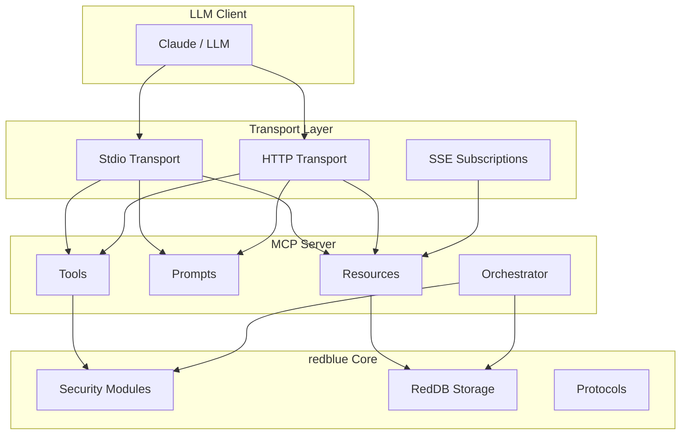

# MCP Integration

> Model Context Protocol server for LLM-assisted security operations

The MCP (Model Context Protocol) server exposes redblue's capabilities to AI assistants like Claude, enabling natural language security operations.

## Capabilities

| Component | Count | Description |
|-----------|-------|-------------|
| **Tools** | 100+ | Executable security operations |
| **Prompts** | 35+ | Pre-built security workflows |
| **Resources** | 40+ | Data feeds and scan results |
| **Sampling** | Yes | LLM-guided autonomous operations |

## Quick Start

### Start the Server

```bash
# Stdio transport (for Claude Desktop)
rb mcp server start

# With HTTP transport
rb mcp server start --http-addr 127.0.0.1:8787

# With SSE subscriptions
rb mcp server start --http-addr 127.0.0.1:8787 --sse

# Filter tools by category
rb mcp server start --categories=network,dns,web

# Use a preset (all, core, blue-team, red-team, web-security, minimal)
rb mcp server start --preset=blue-team
```

### Claude Desktop Configuration

Add to `~/.config/claude/claude_desktop_config.json`:

```json
{
  "mcpServers": {
    "redblue": {
      "command": "rb",
      "args": ["mcp", "server", "start"]
    }
  }
}
```

## Architecture



## Use Cases

### Natural Language Queries

```
"Find vulnerabilities for nginx 1.18"
"Scan 192.168.1.0/24 for open ports"
"What attack techniques target web servers?"
```

### Autonomous Operations

The orchestrator enables LLM-guided security operations:

1. Start with a target
2. Run initial reconnaissance
3. Request LLM guidance on next steps
4. Execute recommended actions
5. Repeat until complete or paused

### Real-time Monitoring

Subscribe to scan results as they happen:

```json
{
  "method": "resources/subscribe",
  "params": {
    "uri": "redblue://scans/192.168.1.1/ports"
  }
}
```

## Security Considerations

- **Authorization Required** - Some tools require explicit authorization
- **Rate Limiting** - Built-in limits for external API calls
- **Audit Logging** - All operations are logged
- **Human Review Gates** - Autonomous ops pause after N iterations

## See Also

- [Tools Reference](01-tools.md) - All available tools
- [Prompts Reference](02-prompts.md) - Pre-built workflows
- [Resources Reference](03-resources.md) - Data feeds and URIs
- [Autonomous Operations](04-sampling.md) - LLM-guided ops
- [Integration Guide](05-integration.md) - Setup and usage
