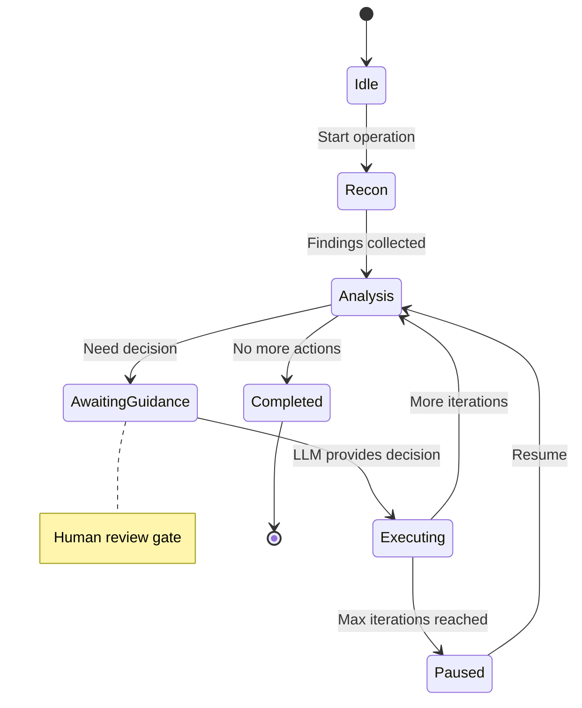

# Autonomous Operations

> LLM-guided security operations with the MCP orchestrator

The orchestrator enables autonomous security operations guided by LLM decisions.

## Concept

Instead of manual tool invocation, the orchestrator:

1. **Runs initial reconnaissance** automatically
2. **Collects findings** into a context
3. **Requests LLM guidance** on next steps
4. **Executes recommended actions**
5. **Repeats** until complete or paused

## State Machine



## Starting an Operation

### Autonomous Reconnaissance

```json
{
  "method": "tools/call",
  "params": {
    "name": "rb.auto.recon",
    "arguments": {
      "target": "example.com",
      "max_iterations": 5
    }
  }
}
```

### Autonomous Vulnerability Assessment

```json
{
  "method": "tools/call",
  "params": {
    "name": "rb.auto.assess",
    "arguments": {
      "target": "192.168.1.1",
      "max_iterations": 10
    }
  }
}
```

## Operation Flow

### 1. Initial Reconnaissance

The orchestrator automatically runs:
- Quick port scan (common ports)
- DNS resolution
- Service detection

### 2. Analysis

Findings are categorized by:
- Type (open port, vulnerability, technology)
- Severity (critical, high, medium, low, info)
- Data (port, service, CVE, etc.)

### 3. Sampling Request

The orchestrator creates a sampling request for the LLM:

```json
{
  "method": "sampling/createMessage",
  "params": {
    "messages": [
      {
        "role": "user",
        "content": {
          "type": "text",
          "text": "Based on the scan findings..."
        }
      }
    ],
    "maxTokens": 1000,
    "includeContext": "thisServer"
  }
}
```

### 4. LLM Guidance

The LLM responds with structured guidance:

```json
{
  "priority_ports": [3306, 5432, 27017],
  "next_actions": ["vuln_scan", "service_enum"],
  "reasoning": "Database ports found, need deeper analysis"
}
```

### 5. Execution

The orchestrator executes the recommended action and records results.

## Iteration Limits

Operations have built-in safety limits:

| Operation Type | Default Max | Notes |
|---------------|-------------|-------|
| Recon | 10 | Pauses for human review |
| Vuln Scan | 15 | More iterations for thorough scan |

When the limit is reached:
1. Operation pauses
2. User is notified
3. User can resume or stop

## Operation Status

Check operation status:

```json
{
  "method": "tools/call",
  "params": {
    "name": "rb.auto.status",
    "arguments": {
      "operation_id": "recon-1"
    }
  }
}
```

Response:
```json
{
  "id": "recon-1",
  "target": "example.com",
  "state": "AwaitingGuidance",
  "findings": 12,
  "actions": 3,
  "iteration": 4,
  "max_iterations": 10
}
```

## Resuming Operations

Resume a paused operation:

```json
{
  "method": "tools/call",
  "params": {
    "name": "rb.auto.resume",
    "arguments": {
      "operation_id": "recon-1"
    }
  }
}
```

## Stopping Operations

Stop an operation early:

```json
{
  "method": "tools/call",
  "params": {
    "name": "rb.auto.stop",
    "arguments": {
      "operation_id": "recon-1"
    }
  }
}
```

## Getting Findings

Retrieve all findings from an operation:

```json
{
  "method": "tools/call",
  "params": {
    "name": "rb.auto.findings",
    "arguments": {
      "operation_id": "recon-1"
    }
  }
}
```

## Human Review Gates

The orchestrator includes safety mechanisms:

1. **Iteration Limits** - Automatic pause after N iterations
2. **Action Logging** - All actions are recorded
3. **Explicit Resume** - User must explicitly continue
4. **Stop Capability** - Can halt at any time

## Finding Types

| Type | Description |
|------|-------------|
| `OpenPort` | Discovered open port |
| `Service` | Identified service |
| `Vulnerability` | Found vulnerability |
| `Technology` | Detected technology |
| `Subdomain` | Discovered subdomain |
| `Credential` | Found credential |

## Severity Levels

| Level | Description |
|-------|-------------|
| `Critical` | Immediate action required |
| `High` | Significant risk |
| `Medium` | Moderate concern |
| `Low` | Minor issue |
| `Info` | Informational |

## See Also

- [Overview](00-overview.md) - MCP introduction
- [Tools](01-tools.md) - Available tools
- [Prompts](02-prompts.md) - Pre-built workflows
